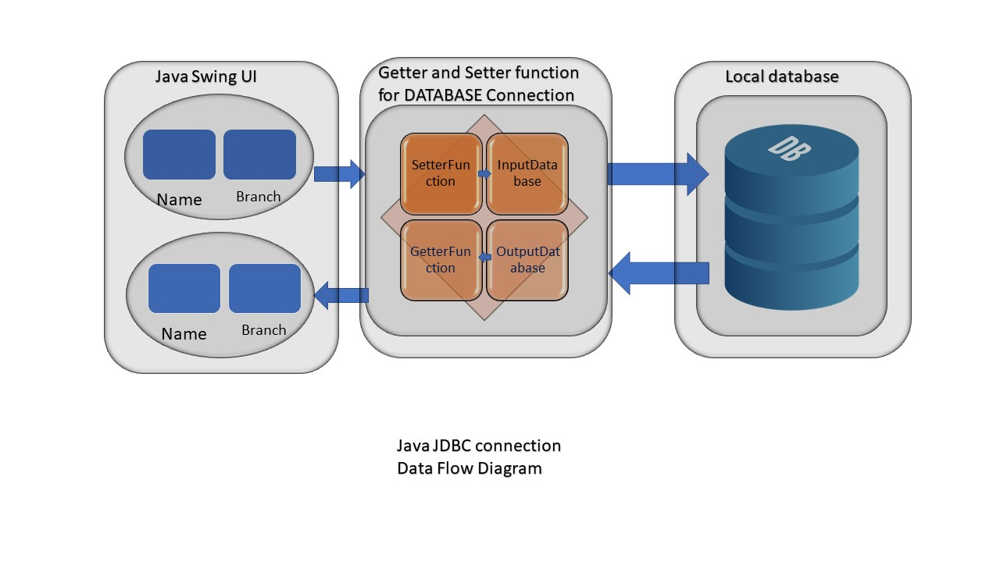

## Folder Structure

The workspace contains two folders by default, where:

- `src`: the folder to maintain sources
- `lib`: the folder to maintain dependencies

Meanwhile, the compiled output files will be generated in the `bin` folder by default.
## About project

In this project i will get input from user using java GUI (swing) package and seve the data on local database and display it on a table. 

